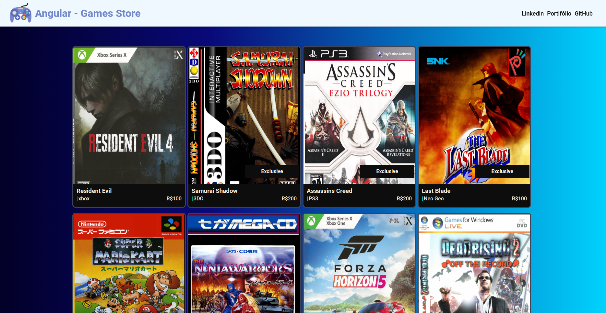

# GamesStore

Projeto de estudos desenvolvido com angular 14, na intenção componentizar elementos em um projeto angular e reaproveitá los na montagem da página.

Para rodar o projeto local, basta fazer o clone do projeto executar o comando **npm install** para baixar as dependências e posteriormente executar o comando ng server para carregar no seu navegador http://localhost:4200/
